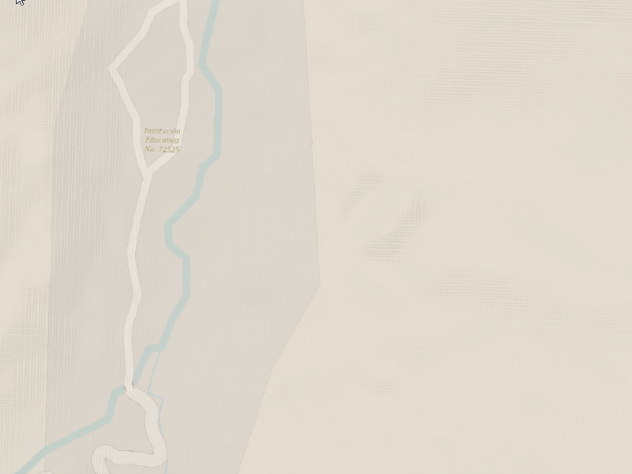
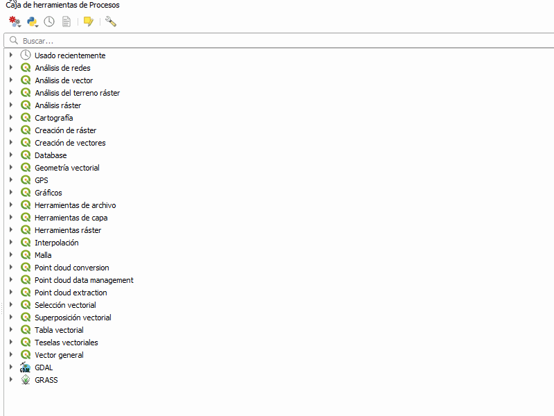
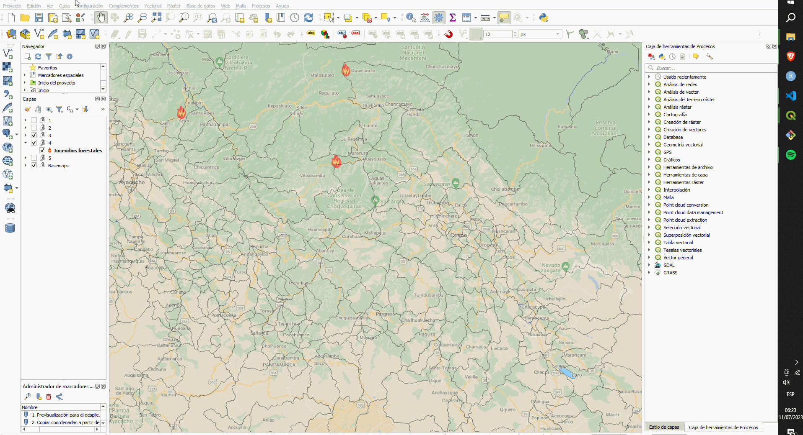
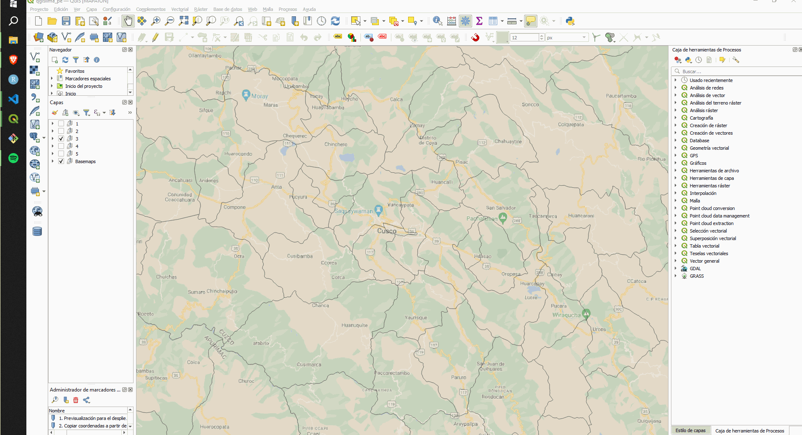
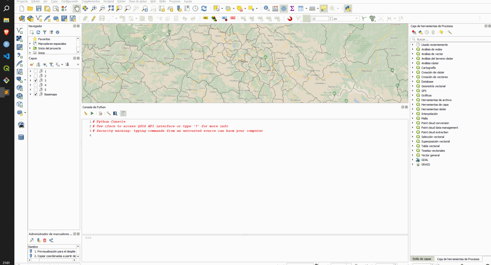

<h1># Novedades 😃🎁 </h1>

La <b>**Asociación QGIS Perú**</b> promueve el uso y manejo de QGIS en el Perú, mediante talleres, exposiciones, ponencias, soporte y difusión del software de análisis espacial y diseño cartográfico. El 24 de junio de 2023 fue lanzado <b>QGIS 3.32 Lima</b>. Esta versión es una de las más significativas del proyecto QGIS, ya que aporta un avance robusto en tecnologías geoespaciales para los usuarios del código abierto, en general, al mundo GIS. La comunidad de desarrolladores QGIS han unido esfuerzos para generar múltiples nuevas funciones y mejoras para aprovechar el potencial de los datos geoespaciales.
 

**Luis Ferrer 👨‍💻 - Asociación QGIS Perú**

#ComparteYlibérate

 
 
 

<h1># Recursos 📚</h1>

 👉 [QGIS 3.32 Lima](https://qgis.org/es/site/forusers/download.html)
  
 👉 [Servicios WFS para descargar información de mapas](https://www.geoidep.gob.pe/catalogo-nacional-de-servicios-web/servicios-de-publicacion-de-objetos-wfs)
  
  👉 [GenCAT - Institut Cartogràfic i Geològic de Catalunya](https://www.icgc.cat/es/Administracion-y-empresa/Descargas/Elevaciones/Datos-lidar)
  
 👉 [Asociación QGIS Perú](https://qgis.pe)
 
 
 
 

 <h1># Top 10 de nuevas funcionalidades ✨🏆</h1>

<h1>📌 1. Previsualización para el despliegues de etiquetas personalizadas.</h1>

A través de las propiedades de una capa geográfica, ahora podemos previsualizar los atributos personalizados mediante HTML, tanto para datos raster y vectoriales, lo que enriquece la experiencia de diseño cartográfico.

 
 

<h1>📌 2. Copiar coordenadas a partir de la herramienta Medición.</h1>

Ahora, mientras despliegues el cuadro de diálogo, obtienes:
- Las columnas X y Y con sus coordenadas respectivas.
- La primera fila de la tabla solo contiene coordenadas.
- El prompt del QGIS nos avisa que se ha copiado satisfactoriamente la información.
- Con el botón "Copy" obtienes la información total de la medición.

 
 

<h1>📌 3. Deshabilitar los despliegues de etiquetas personalizadas.</h1>

Además de la previsualización de los despliegues de etiquetas, un nuevo elemento permite deshabilitar estos despliegues para una capa específica.

 
 

<h1>📌 4. Botón de borrado de CRS.</h1>

Se ha implementado el botón que permite eliminar los sistemas de referencias de coordenadas seleccionados para el QGZ.

 
 

<h1>📌 5. Modo reverso de la rueda de acercamiento.</h1>

Ahoa es posible invertir el modo de direccionamiento del acercamiento con la rueda del mouse.

 
 

<h1>📌 6. Implementación de algoritmos de análisis para datos LiDAR.</h1>

Esta nueva versión incluye más de 15 algoritmos para la migración de formatos, cortes, realces, entre otros; para que lo utilices en datos LiDAR.

 
 

<h1>📌 7. Acoplamiento de la ventana 2D Nueva Vista de Mapa.</h1>

Se ha añadido una nueva acción que permite acoplar y desacoplar la vista del lienzo del mapa 2D, lo cual también permite coincidir con el comportamiento de la vista 3D.

 
 

<h1>📌 8. Invertir selección en Rehacer campos.</h1>

Gestionar campos de manera eficiente ahora es posible con esta mejora, que permite la eliminación por lotes de campos específicos.

 
 

<h1>📌 9. Administrar perfiles.</h1>

Ahora podemos gestionar distintos tipos de perfiles (usuarios) para predefinirlos de manera personalizada. Por ejemplo, podemos ahora añadir un ícono de usuario.

 
 

<h1>📌 10. Correr comandos desde la consola de Python.</h1>

Nuestra famosa consola ahora ejecuta comandos de IPython con las sintaxis !<cmd>. El acceso a pip ahora es más sencillo.

